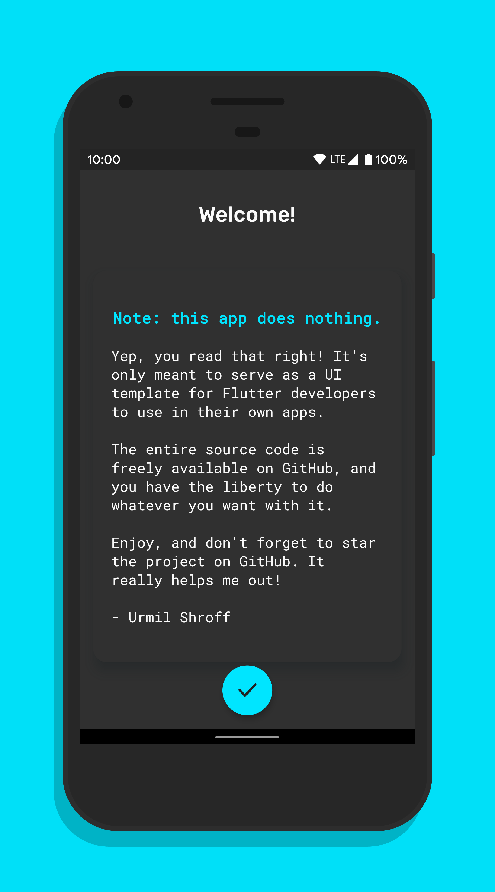
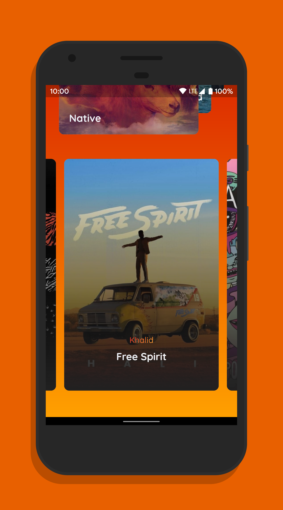
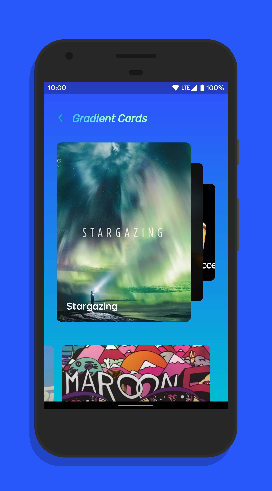

# Dashboard Reborn✨

A very sexy Flutter template app with great focus on UI, design and animations. It is written entirely in Dart code and built using Flutter widgets, so it can be compiled to run (very smoothly) on both Android and iOS.

## Screenshots📸

    

## UI Demos📱

  

## Usage💻

There are three main pages in the app:

-   **About Page:** a clean, neutral cards layout mostly consisting of text.
-   **Material++ Page:** a lively, heavily animated page consisting of bold Material Design colors.
-   **Gradients Page:** a beautiful paginated cards layout complete with a colorful gradients theme.

You can use these individual components or all of them together as a template or starting point in your own Flutter app. It's completely free, as in beer and speech!

That said, if you liked this project and found it helpful, kindly fork/star this repo to show your support, and perhaps checkout some of [my other projects](https://github.com/urmilshroff?tab=repositories). It really helps!😁

## Building🛠

To build and run the app on your device, do the following:

-   [Install Flutter](https://flutter.dev/docs/get-started/install/) by following the instructions on their website
-   Fork/clone this repo to your local machine using `git clone https://github.com/urmilshroff/dashboard_reborn.git`
-   Connect your devices/emulators and run the app using `flutter run --release` in the root of the project directory.

**Note:** you can also run it faster in debug mode using `flutter run`, but the animations will be choppy and performance won't be as expected.

## Contributing💭

Found any bugs? Have any suggestions or code improvements? [Submit an issue](https://github.com/urmilshroff/dashboard_reborn/issues) or fork and [send a pull request](https://github.com/urmilshroff/dashboard_reborn/pulls) with your changes. All contributions are more than welcome, and will be merged into `master` if satisfactory.

## Credits👑

Huge shoutout to all the amazing libraries and projects that I've used, without which this app wouldn't have been possible:

-   [Awesome Flutter](https://github.com/Solido/awesome-flutter) by Solido
-   [Dynamic Theme](https://github.com/Norbert515/dynamic_theme) by Norbert515
-   [Eva Icons Flutter](https://github.com/piyushmaurya23/eva_icons_flutter) by piyushmaurya23
-   [Staggered Grid View](https://github.com/letsar/flutter_staggered_grid_view) by letsar
-   [Gradient Widgets](https://github.com/bluemix/Gradient-Widgets) by bluemix
-   [Dashboard](https://github.com/Ivaskuu/dashboard) by Ivaskuu
-   [Buy Ticket Design](https://github.com/MarcinusX/buy_ticket_design) by MarcinusX
-   [Story App UI](https://github.com/devefy/Flutter-Story-App-UI) by devefy
-   [Page Transformer](https://github.com/roughike/page-transformer) by roughike

Special shoutout to [Arabi Ishaque](https://dribbble.com/Arabi) for making that dope icon!

And of course, the [Flutter framework](https://github.com/flutter/flutter) by Google.

Take a look at the entire list of [contributors](https://github.com/urmilshroff/dashboard_reborn/graphs/contributors) to see who all have helped with the project directly.

## License⚖

This project is licensed under the MIT License - do anything you want with the code! See the [LICENSE](LICENSE) file for details.
